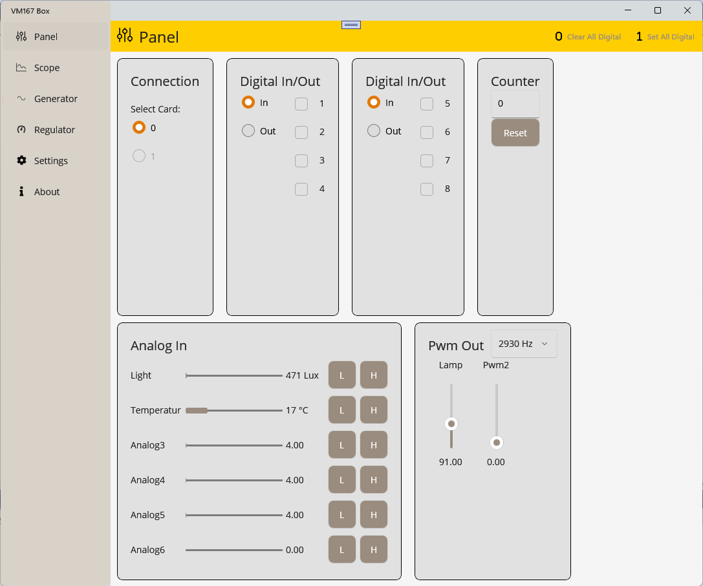
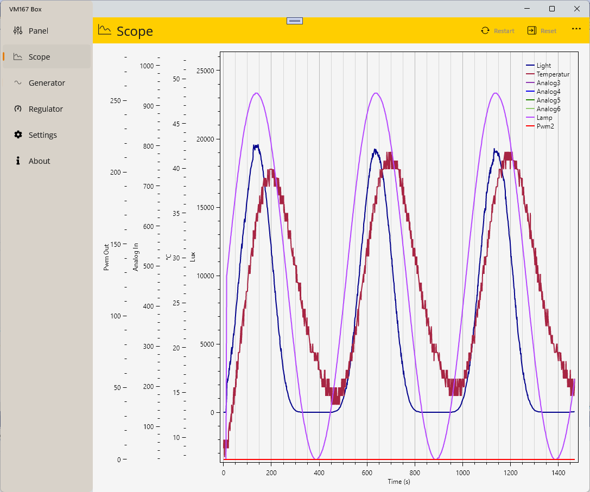

# Vm167 Box

## Introduction
This is the decription of the hardware and software of the VM167Box. The VM167Box contains the Velleman VMI167 USB interface board, with the I/O pins extended to connectors to the front and back of the box. The software is written in .NET MAUI and compiles for both Windows and Mac, however the drivers from Velleman is only available for Windows.

 { width=50% }  
Panel view

 { width=50% }  
Scope view

## Velleman VM167 USB Interface Board
The VM167 USB interface board has 8 digital input/output channels, five analog input channels and two PWM outputs. The number of inputs/outputs can be expanded by connecting two VM167 cards to the PC.

- Specifications for the discontinued [VM167 interface board](https://www.velleman.eu/products/view/?id=384006&lang=en).
- Specifications for the new [VMI167 interface board](https://www.velleman.eu/products/view/?id=461758).
- Velleman VM167 [Driver and Examples](https://github.com/Velleman/VM167_MINI_USB_INTERFACE_BOARD) on GitHub.
- Velleman VM167 [User manual](https://cdn.velleman.eu/downloads/0/modules/usermanual_vm167.pdf) explaining the module's possibilities and how to use the module.
- Velleman VM167 [Dynamic Link Library](https://cdn.velleman.eu/downloads/0/infosheets/vm167_dll_manual.pdf) communication routines documentation.
- Velleman VM167 [SDK Rev 1.18.18](https://cdn.velleman.eu/downloads/files/downloads/vm167_sdk_rev1818.exe) software development pack with drivers,DLL,demo, diagnose and program examples.

## PID Controller
- [PID Controller](https://en.wikipedia.org/wiki/Proportional%E2%80%93integral%E2%80%93derivative_controller)